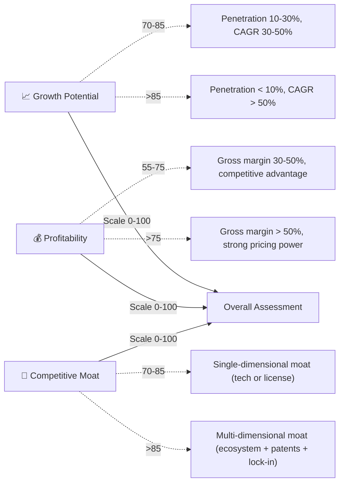

<p align="center">
  
  
  
  
  
  
  
  
</p>

<h1 align="center">🗺️ Industry Atlas</h1>
<p align="center"><b>Interactive Industry Analysis Visualizations — Panorama · Chain · Sector Bubble · Company Bubble</b></p>
<p align="center">
  🤖 Claude Code · 💻 Codex CLI · 🦙 OpenClaw · 🌀 Cursor · Any General-Purpose AI Agent
</p>

<p align="center">
  <a href="#-what-is-industry-atlas">🎯 What</a> • 
  <a href="#-four-modes-in-one">🗺️ Four Modes</a> • 
  <a href="#-live-demos">🎬 Live Demos</a> • 
  <a href="#-install">🚀 Install</a> • 
  <a href="#-quick-start">⚡ Quick Start</a> • 
  <a href="#-project-structure">📁 Structure</a> • 
  <a href="#-scoring-system">📊 Scoring</a>
</p>

> [中文说明](README.zh.md)

---

## 🎯 What Is Industry Atlas?

Industry Atlas is an **AI Agent skill** that generates interactive D3.js HTML visualizations for **any industry**. Give it an industry name, and it produces a self-contained, interactive analysis chart — no coding required.

Instead of describing what it does, here's what it **already made** in 5 minutes each:

| Mode | Output | Industry |
|:-----|:-------|:---------|
| 🌐 L1 Panorama | Radial ring ecosystem | New Energy (6 clusters, 30+ segments) |
| 🔗 L2 Chain | Vertical layered supply chain | Battery Industry (upstream→midstream→downstream) |
| 💎 L3 Sector Bubble | 4-quadrant growth×profit×moat | Semiconductor Materials (12 sectors) |
| 🏢 L4 Company Bubble | 4-quadrant + brand colors | NEV Companies (8 brands, all brand colors) |

> **No external dependencies** except D3.js (CDN-loaded). Output is a single `.html` file — open in browser, share with your team, embed in reports.

---

## 🗺️ Four Modes in One

Industry Atlas uses a **progressive L1→L4 framework** that mirrors how analysts think:

```
L1: See the big picture   →  L2: Understand the chain   →  L3: Find the best sectors   →  L4: Pick the winners
     (Radial Panorama)         (Layered Chain)               (Sector Bubble)                  (Company Bubble)
```

| Mode | Layout | Question It Answers | Sample Output |
|:-----|:-------|:--------------------|:--------------|
| **L1 Panorama** 🗺️ | Radial ring | "What's the overall ecosystem of this industry?" | 1 center + N clusters + M sub-items, cross-cluster links |
| **L2 Chain** 🔗 | Vertical layered | "What's the upstream→midstream→downstream structure?" | 2-4 layers, 6-15 nodes per layer, flow arrows |
| **L3 Sector Bubble** 💎 | 4-quadrant scatter | "Which sectors are most profitable?" | Growth↑ × Profit→ × Moat(area), golden leaders highlighted |
| **L4 Company Bubble** 🏢 | 4-quadrant + brand colors | "Which companies to invest in?" | Same as L3 + brand colors, golden edge for leaders, breadcrumb |

Each mode has a **complete reference template** (250-430 lines) in `references/`, ready to customize for any industry.

---

## 🎬 Live Demos

Here are real outputs generated by Industry Atlas — every HTML file is self-contained and interactive:

### 🔗 L2: Power Battery Industry Chain
**Input:** "生成一张动力电池产业链全景图谱，分上游原材料（锂、钴、镍、石墨、电解液、隔膜）、中游电芯制造（正极/负极/电解液/隔膜/铜箔/铝箔）、下游应用（电动汽车/储能/消费电子）。深空科技风。"

**Auto-detected:** L2 mode (keywords "产业链" + "上中下游"), green-gold title for new energy, 24 nodes across 3 layers with 28+ cross-layer links.

### 🏢 L4: NEV Company Comparison
**Input:** "帮我对比一下新能源车公司：特斯拉、比亚迪、蔚来、小鹏、理想、小米汽车、吉利极氪。用气泡图评估增长潜力、盈利能力、竞争壁垒，用各公司品牌色。深色科技风，适合汽车投资的象限标签。"

**Auto-detected:** L4 mode (keywords "公司对比" + "品牌"), brand colors per company, custom quadrant labels for auto investment.

---

## 🚀 Install

### As a Claude Code Skill
```bash
git clone https://github.com/huajielong/industry-atlas.git ~/.claude/skills/industry-atlas
```

### As a Codex CLI Skill
```bash
git clone https://github.com/huajielong/industry-atlas.git ~/.codex/skills/industry-atlas
```

### Any AI Agent (Manual)
1. Download [industry-atlas.zip](https://github.com/huajielong/industry-atlas/archive/main.zip)
2. Extract to your agent's skill directory
3. Or simply tell your agent: *"Read this SKILL.md and follow its instructions"*
4. Paste the prompt describing your industry analysis needs

### Pure Methodology (No Installation)
Even without installation, you can share the workflow with any AI:

> *"You are an industry analysis visualization expert. Generate an interactive D3.js HTML analysis for [industry name]. Use 4 progressive modes: L1 radial panorama, L2 layered chain, L3 4-quadrant sector bubble, L4 4-quadrant company bubble. Each with growth×profit×moat scoring. Deep tech dark theme."*

---

## ⚡ Quick Start

### Step 1: Tell the AI what you need
```
帮我分析一下半导体产业，做一张全景图谱。
帮我对比一下新能源汽车产业链上中下游。
哪些 AI 应用板块最赚钱？画一张气泡图。
我要对比 ASML、应用材料、东京电子这几家半导体设备公司。
```

### Step 2: The AI auto-detects the mode
| Your Keywords | Mode | 
|:--------------|:-----|
| "全景" "生态" "集群" | L1 Panorama |
| "产业链" "上中下游" "供应链" | L2 Chain |
| "板块" "赛道" "哪里最赚钱" | L3 Sector Bubble |
| "标的" "公司对比" "品牌色" | L4 Company Bubble |

### Step 3: You get a self-contained `.html` file
Open it in browser → interact with the chart → share with your team.

### Customization
- **Scores**: Provide your own growth/profit/moat data, or let the AI score based on industry knowledge
- **Colors**: Title gradient auto-adapts to the industry (AI=blue-purple, new energy=green-gold, chips=orange-red, biotech=blue-green)
- **Labels**: Quadrant names are fully customizable (e.g., "🥇 Golden Sector" → "🎯 Strategic Priority")
- **Data**: Add/remove nodes, clusters, or companies freely — the layout auto-adjusts

---

## 📊 Scoring System

L3 and L4 modes use a standardized three-dimensional scoring framework:



Every score comes with an **explanation rationale** — not arbitrary numbers.

---

## 📁 Project Structure

```
industry-atlas/
├── SKILL.md                    ← AI Agent skill definition (~500 lines)
├── LICENSE                     ← MIT license
├── README.md                   ← This file (English)
├── README.zh.md                ← Chinese version
│
├── scripts/                    ← Reusable D3.js modules (inlined into output)
│   ├── visual-foundation.js    ← Background dots, title shimmer, responsive
│   ├── interaction-system.js   ← Glass tooltip, hover highlight, drag, zoom
│   └── bubble-engine.js        ← Score bars, brand colors, quadrant labels
│
├── references/                 ← Complete reference templates (customize data only)
│   ├── mode-panorama.html      ← L1: Radial ring layout (428 lines)
│   ├── mode-chain.html         ← L2: Vertical layered layout (342 lines)
│   ├── mode-bubble-sector.html ← L3: 4-quadrant sector bubble (236 lines)
│   └── mode-bubble-company.html← L4: 4-quadrant + brand colors (247 lines)
│
└── evals/
    └── evals.json              ← 8 cross-industry test cases
```

### File Roles

| File | Role | How It's Used |
|:-----|:-----|:--------------|
| `SKILL.md` | Instructions for the AI agent | Read by the agent on trigger — defines intent detection, scoring, visual design, and generation workflow |
| `scripts/*.js` | Reusable D3.js functions | Read by the agent and **inlined** into the output HTML. Each function is documented with JSDoc |
| `references/*.html` | Complete working examples | Read by the agent as structural templates. The agent copies the skeleton, replaces the DATA section, and customizes for the target industry |

---

## 🧠 Why D3.js?

| Feature | Approach |
|:--------|:---------|
| **Visualization** | D3.js v7 — SVG + Canvas hybrid for best interactivity |
| **Layout** | Force-directed simulation with custom forces (layered Y, angle constraint, cluster attraction) |
| **Interaction** | Hover highlight + glassmorphism tooltip + drag + zoom/pan |
| **Responsiveness** | Desktop (1920px) → tablet (768px) → mobile (480px) — matching CSS media queries |
| **Self-contained** | Single `.html` file, zero external files needed (D3.js via CDN, optional) |

---

## ⚠️ Known Limitations

| Limitation | Mitigation |
|:-----------|:-----------|
| Scores based on Claude's industry knowledge, not precise financial data | Prompt says "scores are based on industry cognition — verify with latest annual reports" |
| CDN dependency for D3.js — offline not available | Pre-download D3.js v7 for offline use |
| Performance degrades above 80 nodes | Batch large datasets; each mode caps at ~15-30 nodes per layer/cluster |
| Brand color table covers well-known companies only | Uncovered companies use group color highlight; user can provide brand colors |

---

## 🔗 Related Projects

- [**skill-evaluator**](https://github.com/huajielong/skill-evaluator) — AI Agent skill quality scoring (5-dimension + security gate)
- [**claude-skills**](https://github.com/huajielong/claude-skills) — Collection of Claude Code skills

---

<p align="center">
  Made with 🧠 by <a href="https://github.com/huajielong">huajielong</a>
  <br>
  <sub>MIT License · Free for any use · Contributions welcome!</sub>
</p>
