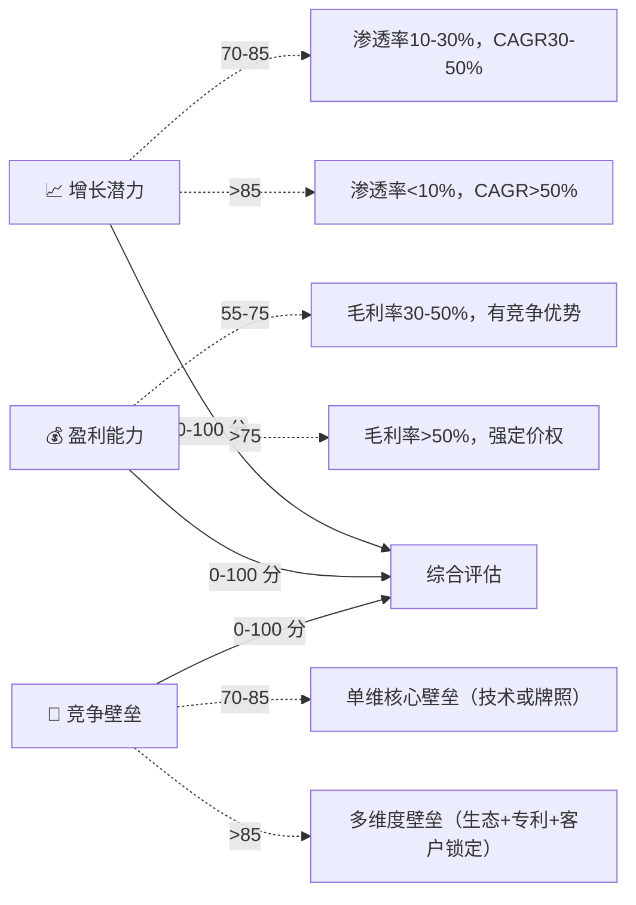

<p align="center">
  
  
  
  
  
  
  
  
</p>

<h1 align="center">🗺️ Industry Atlas</h1>
<p align="center"><b>任意产业分析互动可视化 — 全景图 · 产业链 · 板块气泡 · 标的公司气泡</b></p>
<p align="center">
  🤖 Claude Code · 💻 Codex CLI · 🦙 OpenClaw · 🌀 Cursor · 任何通用 AI 智能体
</p>

<p align="center">
  <a href="#-是什么">🎯 是什么</a> • 
  <a href="#-四种模式合一">🗺️ 四种模式</a> • 
  <a href="#-实际演示">🎬 实际演示</a> • 
  <a href="#-安装">🚀 安装</a> • 
  <a href="#-快速开始">⚡ 快速开始</a> • 
  <a href="#-项目结构">📁 结构</a> • 
  <a href="#-评分体系">📊 评分</a>
</p>

> [English](README.md)

---

## 🎯 是什么

Industry Atlas 是一个 **AI 智能体技能（AI Agent Skill）** ，为 **任意产业** 生成交互式 D3.js HTML 可视化图表。给一个产业名，它就产出一个可直接运行的、可交互的分析图表——不需要写代码。

不需要听我描述它有多强，看看它 **已经实际产出** 的成果（每个 5 分钟内完成）：

| 模式 | 输出 | 行业 |
|:-----|:------|:------|
| 🌐 L1 全景图 | 辐射圆环生态 | 新能源（6集群，30+细分） |
| 🔗 L2 产业链 | 纵向分层供应链 | 动力电池（上游→中游→下游） |
| 💎 L3 板块气泡 | 四象限增长×盈利×壁垒 | 半导体材料（12个细分赛道） |
| 🏢 L4 公司气泡 | 四象限+品牌色 | 新能源车企（8家品牌色） |

> **无外部依赖**（除 D3.js CDN）。输出单一 `.html` 文件——浏览器打开即用，可分享、可嵌入报告。
>
> 📁 **所有 4 种模式的真实示例见 [`demos/`](./demos) 目录！**

---

## 🗺️ 四种模式合一

Industry Atlas 采用 **递进式 L1→L4 分析框架**，与分析师思维方式一致：

```
L1: 看全貌   →  L2: 看结构   →  L3: 看赛道   →  L4: 选标的
 (辐射全景)      (分层产业链)      (板块气泡)       (公司气泡)
```

| 模式 | 布局 | 解决的问题 | 效果 |
|:-----|:------|:------------|:------|
| **L1 全景图** 🗺️ | 辐射圆环 | "这个产业的整体生态是什么样的？" | 1个中心+N集群+M细分+跨集群关联线 |
| **L2 产业链** 🔗 | 纵向分层 | "上中下游有哪些环节？传导关系是什么？" | 2-4层，每层6-15节点，流向箭头 |
| **L3 板块气泡** 💎 | 四象限散点 | "哪个赛道最赚钱？" | 增长↑×盈利→×壁垒(面积)，龙头金色高亮 |
| **L4 公司气泡** 🏢 | 四象限+品牌色 | "该买哪家公司？" | 同L3+各公司品牌色+龙头金边+面包屑导航 |

每种模式都有 **完整参考模板**（250-430 行），放在 `references/` 目录下，更换数据即可适配任意产业。

---

## 🎬 实际演示

以下是由 Industry Atlas 实际生成的 HTML 文件——每个都是自包含、可交互的：

### 🔗 L2：动力电池产业链全景图
**输入：** "生成一张动力电池产业链全景图谱，分上游原材料（锂、钴、镍、石墨、电解液、隔膜）、中游电芯制造（正极/负极/电解液/隔膜/铜箔/铝箔）、下游应用（电动汽车/储能/消费电子）。深空科技风。"

**自动识别：** L2 模式（关键词"产业链"+"上中下游"），绿金标题渐变，24 个节点 3 层布局，28+ 跨层连线。

### 🏢 L4：新能源车企标的对比气泡图
**输入：** "帮我对比一下新能源车公司：特斯拉、比亚迪、蔚来、小鹏、理想、小米汽车、吉利极氪。用气泡图评估增长潜力、盈利能力、竞争壁垒，用各公司品牌色。深色科技风，适合汽车投资的象限标签。"

**自动识别：** L4 模式（关键词"公司对比"+"品牌"），各公司品牌色，自定义汽车投资象限标签。

---

## 🚀 安装

### 作为 Claude Code 技能
```bash
git clone https://github.com/huajielong/industry-atlas.git ~/.claude/skills/industry-atlas
```

### 作为 Codex CLI 技能
```bash
git clone https://github.com/huajielong/industry-atlas.git ~/.codex/skills/industry-atlas
```

### 任何 AI 智能体（手动）
1. 下载 [industry-atlas.zip](https://github.com/huajielong/industry-atlas/archive/main.zip)
2. 解压到你的 AI 技能目录
3. 或者直接告诉你的 AI：*"阅读这个 SKILL.md 并按指引操作"*
4. 输入你的产业分析需求即可

### 纯方法论（无需安装）
甚至可以把这个方法分享给任何 AI：

> *"你是一个产业分析可视化专家。用 D3.js 为 [产业名] 生成交互式 HTML 图表。使用 4 种递进模式：L1 辐射全景、L2 分层产业链、L3 四象限板块气泡（Y轴=增长潜力、X轴=盈利能力、面积=竞争壁垒）、L4 四象限公司气泡。深色科技风。"*

---

## ⚡ 快速开始

### 第一步：告诉 AI 你需要什么
```
帮我分析一下半导体产业，做一张全景图谱。
帮我对比一下新能源汽车产业链上中下游。
哪些 AI 应用板块最赚钱？画一张气泡图。
我要对比 ASML、应用材料、东京电子这几家半导体设备公司。
```

### 第二步：AI 自动识别模式
| 你的关键字 | 模式 |
|:-----------|:-----|
| "全景" "生态" "集群" "概览" | L1 全景图 |
| "产业链" "上中下游" "供应链" "价值链" | L2 产业链 |
| "板块" "赛道" "哪里最赚钱" "投资价值" | L3 板块气泡 |
| "标的" "公司对比" "品牌色" "竞争格局" | L4 公司气泡 |

### 第三步：你得到一个 `.html` 文件
浏览器打开 → 交互看图 → 分享给团队。

### 自定义配置
- **评分**：自己提供增长/盈利能力/竞争壁垒数据，或让 AI 基于行业知识自动评分
- **颜色**：标题渐变自动适配产业（AI=蓝紫、新能源=绿金、芯片=橙红、生物医药=蓝绿）
- **标签**：象限名称完全自定义（如"🥇 黄金赛道" → "🎯 战略重点"）
- **数据**：自由增删节点/集群/公司，布局自动适配

---

## 📊 评分体系

L3 和 L4 模式使用标准化的三维评分框架。**严格遵循以下轴定义：**

- **Y 轴 → 增长潜力**（Growth Potential，0-100）
- **X 轴 → 盈利能力**（Profitability，0-100）
- **气泡面积 → 竞争壁垒**（Competitive Moat，0-100）



每个评分都附带 **解释依据**——不是随意给分。

---

## 📁 项目结构

```
industry-atlas/
├── SKILL.md                    ← AI 智能体技能定义（~500 行）
├── LICENSE                     ← MIT 协议
├── README.md                   ← 英文说明
├── README.zh.md                ← 中文说明（本文）
│
├── scripts/                    ← 可复用的 D3.js 模块（内联到输出中）
│   ├── visual-foundation.js    ← 点阵背景、标题 shimmer、响应式适配
│   ├── interaction-system.js   ← 毛玻璃 tooltip、悬停高亮、拖拽、缩放
│   └── bubble-engine.js        ← 评分进度条、品牌色查找、象限标签
│
├── references/                 ← 完整参考模板（只需更换数据）
│   ├── mode-panorama.html      ← L1：辐射圆环布局（428 行）
│   ├── mode-chain.html         ← L2：纵向分层布局（342 行）
│   ├── mode-bubble-sector.html ← L3：四象限板块气泡（236 行）
│   └── mode-bubble-company.html← L4：四象限+品牌色（247 行）
│
└── evals/
    └── evals.json              ← 8 个跨行业测试用例
```

### 各文件角色

| 文件 | 角色 | 使用方法 |
|:-----|:-----|:---------|
| `SKILL.md` | AI 智能体的操作指南 | 触发时被 AI 读取——定义意图识别、评分标准、视觉设计、生成流程 |
| `scripts/*.js` | 可复用 D3.js 函数 | AI 读取后 **内联** 到输出 HTML 中。每个函数都有 JSDoc 文档 |
| `references/*.html` | 完整可运行示例 | AI 读取作为结构模板。复制骨架→替换数据→定制产业内容 |

---

## 🧠 为什么用 D3.js？

| 特性 | 实现 |
|:-----|:------|
| **可视化引擎** | D3.js v7 — SVG + Canvas 混合渲染 |
| **布局算法** | 力导向仿真 + 自定义力（分层 Y 约束、角度约束、集群聚集） |
| **交互能力** | 悬停高亮 + 毛玻璃 tooltip + 拖拽 + 滚轮缩放平移 |
| **响应式** | 桌面(1920px) → 平板(768px) → 手机(480px) 三断点 |
| **自包含** | 单一 `.html` 文件，零外部文件依赖（D3.js 通过 CDN） |

---

## ⚠️ 已知局限

| 局限 | 缓解措施 |
|:-----|:---------|
| 评分基于 Claude 的行业知识，非精确财务数据 | 提示用户"评分基于行业认知，建议参考最新年报验证" |
| CDN 依赖——离线可能不可用 | 可预下载 D3.js v7 以备离线使用 |
| 超过 80 个节点时性能下降 | 分批展示，每层/每集群控制在 15-30 节点 |
| 品牌色表仅覆盖知名公司 | 未覆盖的公司使用分组色高亮；用户可提供品牌色 |

---

## 🔗 关联项目

- [**skill-evaluator**](https://github.com/huajielong/skill-evaluator) — AI 智能体技能质量评分工具（5 维度 + 安全门禁）
- [**claude-skills**](https://github.com/huajielong/claude-skills) — Claude Code 技能合集

---

<p align="center">
  Made with 🧠 by <a href="https://github.com/huajielong">huajielong</a>
  <br>
  <sub>MIT License · 自由使用 · 欢迎贡献！</sub>
</p>
